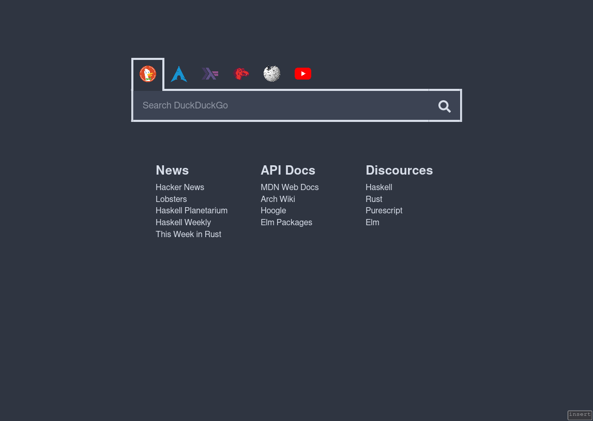

# homepage-server
A command line tool for hosting a page with links and a search bar.
Useful when using [tridactyl](https://github.com/tridactyl/tridactyl), so you can have a neat looking home/newtab page.

## Example Screenshot


## Configuration

### Defaults
By default it will look for a `config.yaml` file in `$XDG_CONFIG_HOME/homepage-server/`,
static assets referenced in the config file in `$XDG_DATA_HOME/homepage-server/`,
and serve the page on port 50000.

### Command Line
These settings may be overridden with the following command line options
```sh
$ homepage-server --help
Usage: homepage-server [-p|--port <port>] [-p|--file <filepath>]
                       [-s|--static <filepath>]
  Run a local homepage server for use in your web browser

Available options:
  -h,--help                Show this help text
  -p,--port <port>         Port the http server runs on (default: 50000)
  -p,--file <filepath>     Path to the configuration yaml file
                           (default: "/home/disco/.config/homepage-server/config.yaml")
  -s,--static <filepath>   Path to search for static assets in
                           (default: "/home/disco/.local/share/homepage-server")
```

### Configuration File
```yaml
searches:
  - name: "DuckDuckGo"
    image: "duckduckgo.png"
    href: "https://duckduckgo.com/?q="

  - name: "Arch Linux Wiki"
    image: "archlinux.png"
    href: "https://wiki.archlinux.org/index.php?search="

  - name: "Hoogle"
    image: "haskell.png"
    href: "https://hoogle.haskell.org/?hoogle="

  - name: "MDN Web Docs"
    image: "mdn.png"
    href: "https://developer.mozilla.org/en-US/search?q="

  - name: "Wikipedia"
    image: "wikipedia.png"
    href: "https://en.wikipedia.org/w/index.php?search="

  - name: "Youtube"
    image: "youtube.png"
    href: "https://www.youtube.com/results?search_query="

linkGroups:
  - name: "News"
    links:
      - name: "Hacker News"
        href: "https://news.ycombinator.com/"

      - name: "Lobsters"
        href: "https://lobste.rs/"

      - name: "Haskell Planetarium"
        href: "https://haskell.pl-a.net/"

      - name: "Haskell Weekly"
        href: "https://haskellweekly.news/"

      - name: "This Week in Rust"
        href: "Haskell Planetarium"


  - name: "API Docs"
    links:
      - name: "MDN Web Docs"
        href: "https://developer.mozilla.org/en-US/docs/Web"

      - name: "Arch Wiki"
        href: "https://wiki.archlinux.org/index.php"

      - name: "Hoogle"
        href: "https://hoogle.haskell.org/"

      - name: "Elm Packages"
        href: "https://package.elm-lang.org/"

  - name: "Discources"
    links:
      - name: "Haskell"
        href: "https://discourse.haskell.org/"

      - name: "Rust"
        href: "https://users.rust-lang.org/"

      - name: "Purescript"
        href: "https://discourse.purescript.org/"

      - name: "Elm"
        href: "https://discourse.elm-lang.org/"

# You may add additional stylesheets or scripts. The server will look for these
# in `$XDG_CONFIG_HOME/homepage-server/` or the directory specified with `--static`.
stylesheets: []
scripts: []
```

### CSS Variables
The follow variables are available to allow the user to easily change the colors.
```css
html {
  --background-color: hsl(220, 16%, 22%);
  --input-background-color: hsl(222, 16%, 28%);
  --font-color: hsl(219, 28%, 88%);
  --highlight-color: hsl(179, 25%, 65%);
}

```

## How to Install
1. Clone this repository
2. Run `stack install`
3. Create a `config.yaml` file in `$XDG_CONFIG_HOME/homepage-server/`
